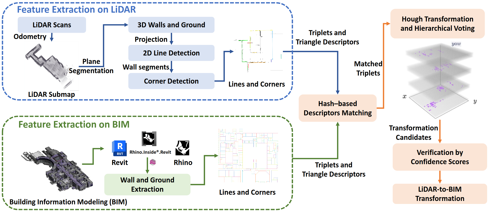
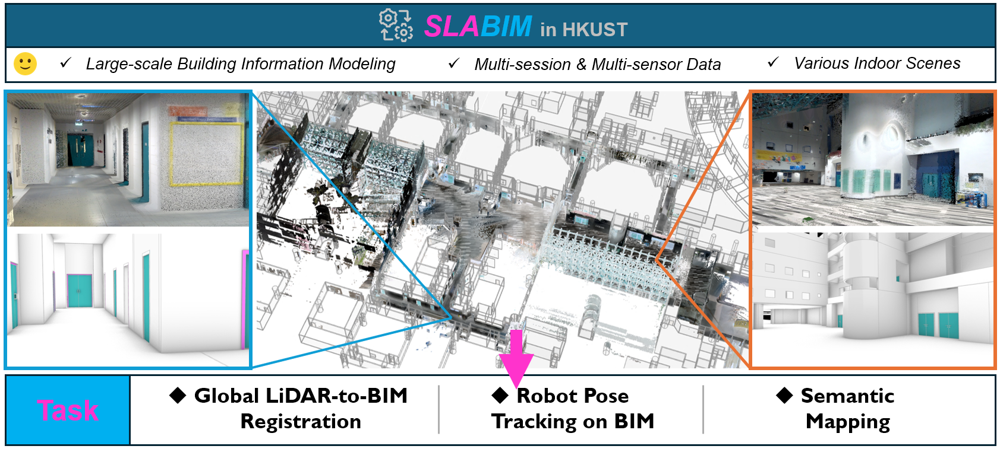

# <div align = "center"> LiDAR2BIM: </div>

## <div align = "center">Speak the Same Language: Global LiDAR Registration on BIM Using Pose Hough Transform</div>
<div align="center">
<a href="https://arxiv.org/abs/2405.03969"></a>
<!-- <a href="https://ieeexplore.ieee.org/document/10518010"></a>
<a href="https://arxiv.org/abs/2308.11573"></a> -->
<a href="https://www.youtube.com/watch?v=SWbnsaRyL-M&t=112s">

</a>
<a ></a>
<a href="https://github.com/HKUST-Aerial-Robotics/LiDAR2BIM-Registration/issues">

</a>
</div>

> [Zhijian Qiao](https://qiaozhijian.github.io/)* *,* Haoming Huang*, Chuhao Liu, Zehuan Yu, [Shaojie Shen](https://uav.hkust.edu.hk/group/), Fumin Zhang and [Huan Yin](https://huanyin94.github.io/)
>
> Accepted to IEEE Transactions on Automation Science and Engineering
> 
> *: Equal Contribution
### News

* **`03 Mar 2025`:** Accepted to [IEEE TASE].
* **`01 May 2024`:** We released our paper on Arxiv and submit it to [IEEE TASE].

## Abstract

<div align="center"><h4>LiDAR2BIM is a fast and robust global registration framework on BIM.</h4></div>

<div align = "center"> </div>

**Features**:
+ **Cross-modality Data Association**: A comprehensive descriptor with O(1) retrieval complexity is proposed for cross-modality data association,
  effectively encoding basic walls and corners in structural
  environments.
+ **A Parallel and Robust Estimator based on Hierarchical Voting**: A Hough transform scheme with hierarchical voting
  is introduced to hypothesize multiple pose candidates,
  followed by verifying the optimal transformation using an
  occupancy-aware score, improving both robustness and
  accuracy.

**Note to Practitioners**:
+ Our proposed registration method lever-
  ages walls and corners as shared features between LiDAR and
  BIM data, making it particularly well-suited for scenarios with
  well-defined structural layouts. Accumulating a larger LiDAR
  submap provides richer structural information, which further
  aids in achieving accurate alignment. To optimize computational
  efficiency, we recommend constructing the descriptor database
  offline and loading it during runtime, enabling a theoretical
  retrieval complexity of O(1). 
+ Despite its advantages, our approach has certain limitations. First, it primarily focuses on
  planar structures, which limits its effectiveness in utilizing nonplanar features. Second, the method may underperform in cases
  where significant deviations exist between the as-designed BIM
  and as-is LiDAR data. Lastly, in ambiguous scenarios, such as
  long corridors or similar layouts within the same or across
  different floors, our method may struggle to verify the correct
  transformation among candidates. To address these challenges,
  incorporating additional information, particularly semantic cues
  such as floor numbers, room numbers, and room types, could
  enhance its robustness and reliability .
## Getting Started
- [Installation](docs/install.md)
- [Data Preparation](docs/prepare.md)
- [Demo](docs/demo.md)
- [Benchmarks](docs/benchmark.md)
## Qualitative results on datasets
### Scene 1: Ground Floor Lobby in HKUST


https://github.com/user-attachments/assets/cb6f4eaa-c37a-4f98-bf78-65a3cd1b1ab1


### Scene 2: Office-3F in HKUST


https://github.com/user-attachments/assets/8aeff703-0f5b-4781-87eb-3842e5eba007


### Scene 3: Office-4F in HKUST


https://github.com/user-attachments/assets/9d83dd4e-5ebe-402f-be2b-a171fa0c5ad3


The LiBIM-UST dataset of this study has been upgraded to
the SLABIM dataset, available at https://github.com/HKUST-Aerial-Robotics/SLABIM. For more comprehensive evaluation, please refer to the SLABIM dataset. (The tutorial of the SLABIM dataset will be released soon.)
<div align = "center"> </div>

## Acknowledgements
We would like to show our greatest respect to authors of the following repos for making their works public:
* [Teaser](https://github.com/MIT-SPARK/TEASER-plusplus)
* [3DBBS](https://github.com/KOKIAOKI/3d_bbs)
## Citation
If you find ```LiDAR2BIM``` or ```SLABIM```dataset is useful in your research or applications, please consider giving us a star 🌟 and citing it by the following BibTeX entry.
```bibtex
@ARTICLE{10916778,
  author={Qiao, Zhijian and Huang, Haoming and Liu, Chuhao and Yu, Zehuan and Shen, Shaojie and Zhang, Fumin and Yin, Huan},
  journal={IEEE Transactions on Automation Science and Engineering}, 
  title={Speak the Same Language: Global LiDAR Registration on BIM Using Pose Hough Transform}, 
  year={2025},
  volume={},
  number={},
  pages={1-1},
  keywords={Point cloud compression;Robots;Laser radar;Three-dimensional displays;Buildings;Service robots;Semantics;Transforms;Sensors;Navigation;Point cloud registration;LiDAR;Building information modeling;Hough transform},
  doi={10.1109/TASE.2025.3549176}
  }
```
```bibtex
@article{huang2025slabim,
  title={SLABIM: A SLAM-BIM Coupled Dataset in HKUST Main Building},
  author={Huang, Haoming and Qiao, Zhijian and Yu, Zehuan and Liu, Chuhao and Shen, Shaojie and Zhang, Fumin and Yin, Huan},
  journal={arXiv preprint arXiv:2502.16856},
  year={2025}
}
```
