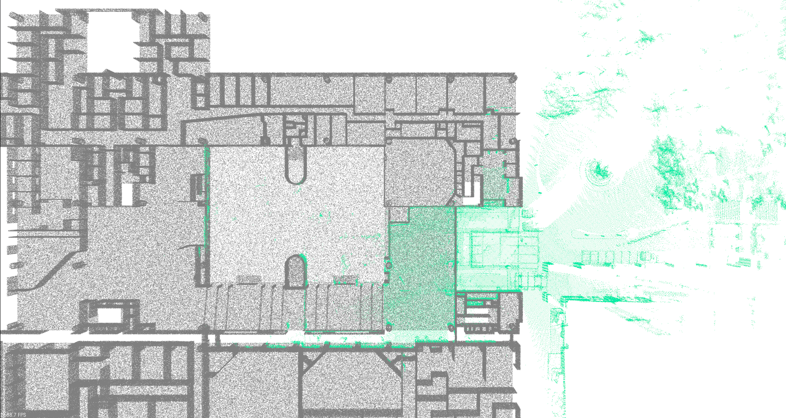
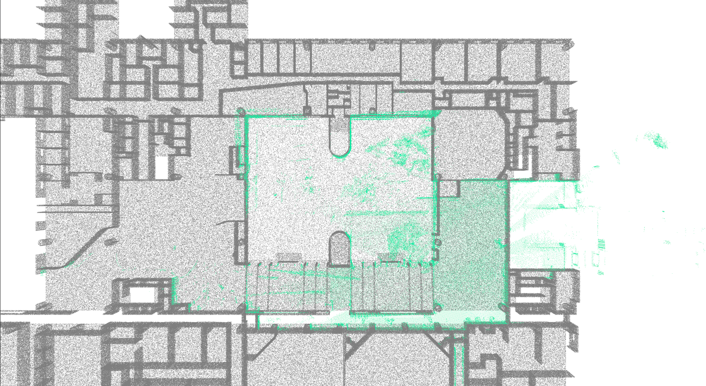
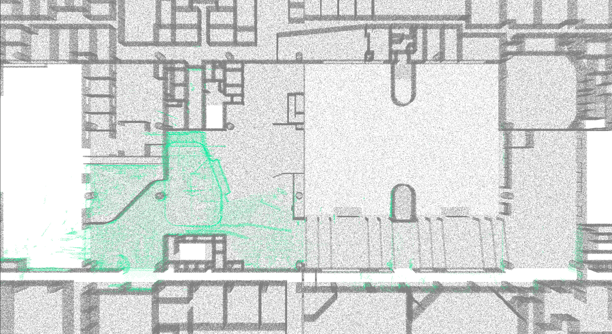
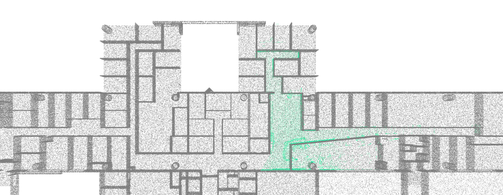

## Demo

### Try a default demo
```angular2html
export LiBIM_UST_ROOT="path/to/LiBIM-UST"
# e.g., export LiBIM_UST_ROOT="/home/bob/datasets/LiBIM-UST/"
bin/demo_reg
```
<div align = "center"> </div>

### Try a demo with a specific submap index
```angular2html
bin/demo_reg 0
```
<div align = "center"> </div>

```angular2html
bin/demo_reg 30
```
<div align = "center"> </div>


### Try a demo with a specific sequence and submap index
```angular2html
bin/demo_reg /configs/interval/15m/2F/2f_office_01.yaml 0
# available sequences:
# /configs/interval/15m/2F/2f_office_01.yaml
# /configs/interval/15m/2F/2f_office_02.yaml
# /configs/interval/15m/2F/2f_office_03.yaml
# /configs/interval/30m/2F/2f_office_01.yaml
# /configs/interval/30m/2F/2f_office_02.yaml
# /configs/interval/30m/2F/2f_office_03.yaml
```
<div align = "center"> </div>